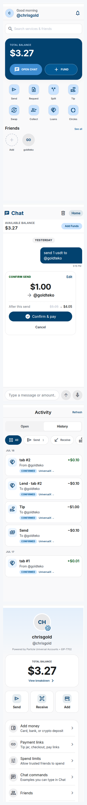

# PayGram

**Cross-chain payments inside Telegram. One balance. Zero chain jargon.**

PayGram is a Telegram Mini App for the [UXmaxx Hackathon](https://www.encodeclub.com/programmes/uxmaxx-hackathon). It combines peer-to-peer payments, creator tipping, bill splitting, group collections, ROSCA circles, and lend/borrow tabs, powered by **Particle Universal Accounts + EIP-7702** with settlement on **Arbitrum One**. Users see one USD balance; bridging, gas, and chain routing stay invisible.

**Stack:** Vite + React · Magic (embedded wallet) · Particle Universal Accounts (EIP-7702) · Arbitrum · custom USDC escrows

**Live:** [https://paygram-rust.vercel.app](https://paygram-rust.vercel.app) · **Telegram Bot (mini app):** [@paygram_bbot](https://t.me/paygram_bbot)

<p align="center">
  
</p>

<p align="center"><em>Home · Chat confirm · Activity history · Me</em></p>

---

## What PayGram is

A full payment product in Telegram, not a single-screen demo:


| Area         | What it does                                                                     |
| ------------ | -------------------------------------------------------------------------------- |
| **Home**     | Unified balance, service grid, friends, net with friends                         |
| **Chat**     | Optional natural-language payments (type, confirm, done)                         |
| **Activity** | Open requests, what you owe / are owed, transaction history                      |
| **Collect**  | Group collection pots with progress, contributions, shareable links              |
| **Circles**  | ROSCA savings circles (on-chain rounds)                                          |
| **Tabs**     | Lend / borrow ledger with on-chain tab vault                                     |
| **Friends**  | PayGram contacts, quick send                                                     |
| **Me**       | Profile, funding, tip/pay links, chat command list, **About** (stack + Arbiscan) |


Dedicated screens cover send, tip, request, split, swap, and remind. Chat and forms share the same payment flows.

---

## Features

### Payments

- **Send** to `@username` or `0x` address
- **Tip** creators and friends
- **Request** payment; settle from Activity
- **Pay all** open requests in one batch

### Groups and credit

- **Split** a bill; per-person requests in Activity
- **Collect** group pots for trips, events, shared expenses
- **Circles** ROSCA rounds with on-chain escrow
- **Tabs** lend / borrow, repay, forgive

### Links and sharing

- **Tip jar**, **pay link**, **checkout** deep links
- **Receipt share** back to Telegram

### Infrastructure (invisible to users)

- Unified balance across chains via Particle UA
- Cross-chain routing via `createUniversalTransaction` + `expectTokens`
- EIP-7702 one-time unlock on Arbitrum
- Magic embedded wallet (no seed phrases)
- On-chain USDC vaults on Arbitrum One for pots, splits, tabs, allowances, ROSCA

---

## Smart contracts (Arbitrum One)

Deployed **2026-07-11**. Vaults settle in Circle USDC on Arbitrum (`0xaf88d065e77c8cC2239327C5EDb3A432268e5831`).  
Rescue guardian (`0x77539C4ec616360751b97563Dd6B4A9dE5D1E578`) can only recover accidental excess tokens — not escrowed user funds.  
**Status:** Source verified on Arbiscan (July 2026).

| Contract | Address | Arbiscan |
|----------|---------|----------|
| **PayGramPot** | `0x6D58560966914637565B4a10ebDADD56ea49E2cF` | [Verified](https://arbiscan.io/address/0x6D58560966914637565B4a10ebDADD56ea49E2cF#code) |
| **PayGramBillEscrow** | `0xe927742DBfFa80Df2575B5220cc74d91459A86A8` | [Verified](https://arbiscan.io/address/0xe927742DBfFa80Df2575B5220cc74d91459A86A8#code) |
| **PayGramRosca** | `0xd6aCb0ef288001c171FCA29300f001970B2e5a45` | [Verified](https://arbiscan.io/address/0xd6aCb0ef288001c171FCA29300f001970B2e5a45#code) |
| **PayGramTab** | `0xcfbb48A1C3890BB9a550d92A3dC0A02571B0A4bE` | [Verified](https://arbiscan.io/address/0xcfbb48A1C3890BB9a550d92A3dC0A02571B0A4bE#code) |
| **PayGramAllowance** | `0x1d19aD900A157d83982816B48f4452bD01eF8B7b` | [Verified](https://arbiscan.io/address/0x1d19aD900A157d83982816B48f4452bD01eF8B7b#code) |

Source: [`contracts/`](./contracts/) · deployment: [`contracts/deployments/arbitrum.json`](./contracts/deployments/arbitrum.json)

### Verify on Arbiscan

1. Get a free API key at [arbiscan.io/myapikey](https://arbiscan.io/myapikey).
2. Add to `contracts/.env`:
  ```
   ARBISCAN_API_KEY=your_key_here
  ```
3. Run:
  ```bash
   cd contracts && npm install && npm run verify:arb
  ```

---

## Chat commands (optional path)

Also listed under **Me → Chat commands**:

```
send $25 to @alice for lunch
tip @creator $5
request $30 from @bob
split $120 with @bob @carol @dave
collect $500 for Bali trip
contribute $10 to pot_abc123
remind @bob
balance
swap $50 to SOL
```

---

## Quick start

```bash
cp .env.example .env
# Fill in Magic + Particle credentials (see .env.example)

npm install
npm run dev        # http://localhost:5173
npm run bot        # Shell bot — needs TELEGRAM_BOT_TOKEN
```

### Environment variables


| Variable                                | Source                                                           |
| --------------------------------------- | ---------------------------------------------------------------- |
| `VITE_MAGIC_API_KEY`                    | [dashboard.magic.link](https://dashboard.magic.link)             |
| `VITE_PROJECT_ID`                       | [dashboard.particle.network](https://dashboard.particle.network) |
| `VITE_CLIENT_KEY`                       | Particle dashboard                                               |
| `VITE_APP_ID`                           | Particle dashboard (create a Web app)                            |
| `VITE_ARB_RPC_URL`                      | Public or Alchemy Arbitrum RPC (optional)                        |
| `VITE_POT`, `VITE_TAB`, …               | From `npm run env:app` in `contracts/` after deploy              |
| `TELEGRAM_BOT_TOKEN`                    | [@BotFather](https://t.me/BotFather)                             |
| `VITE_MINI_APP_URL`                     | Your deployed URL                                                |
| `KV_REST_API_URL` / `KV_REST_API_TOKEN` | Vercel Upstash Redis (username registry, circles)                |


---

## Architecture

```
Telegram Bot (shell)  →  opens  →  PayGram Mini App (Vite + React)
                                        │
                    ┌───────────────────┼───────────────────┐
                    ▼                   ▼                   ▼
                 Home / Me           Activity          Collect / Circles / Tabs
                 Chat (optional)   (pay requests)     (pots, ROSCA, loans)
                    │                   │                   │
                    └───────────────────┼───────────────────┘
                                        ▼
                              Magic (embedded wallet)
                                        ▼
                         Particle UA (EIP-7702 on Arbitrum)
                                        ▼
              createUniversalTransaction (cross-chain USDC settlement)
                                        ▼
                    Arbitrum One escrows (Pot, Bill, Tab, Rosca, Allowance)
```

The bot is the door (menu button and deep links). Product logic lives in the Mini App.

---

## Project structure

```
src/              # React Mini App (pages, hooks, components, lib)
bot/              # Telegram shell bot
api/              # Vercel serverless (registry, requests, pots, circles, tabs, …)
contracts/        # Hardhat vaults + tests + deploy/verify
public/           # Logo and banner assets
demo/             # Optional UI demo sandbox
docs/             # Public note only; pitch/research stay local (.gitignore)
```

---

## Telegram setup

1. Create bot via [@BotFather](https://t.me/BotFather) → `/newbot`
2. `/setdomain` → your deployed Mini App URL
3. Set **Menu Button** → Mini App URL
4. Add `TELEGRAM_BOT_TOKEN` and `VITE_MINI_APP_URL` to `.env`
5. Add your domain to Magic allowed origins

---

## Deploy

```bash
npm run build
# Deploy dist/ + api/ to Vercel
```

### Vercel setup

1. Import repo at [vercel.com](https://vercel.com)
2. Add env vars from `.env.example` (Magic, Particle, Telegram, RPC, contract addresses)
3. **Storage:** Vercel → **Upstash Redis** → connect (adds `KV_REST_API_`*)
4. Deploy. API routes include `/api/user-registry`, `/api/requests`, `/api/pots`, `/api/circles`, `/api/tabs`, …
5. Set `VITE_MINI_APP_URL` to your Vercel URL, redeploy

**Live app:** [https://paygram-rust.vercel.app](https://paygram-rust.vercel.app)  
**Telegram bot:** [@paygram_bbot](https://t.me/paygram_bbot)

### Local full-stack dev

```bash
npm run vercel:dev   # Mini App + API together (needs Vercel CLI)
npm run dev          # Frontend only — API falls back to localStorage
```

---

## Hackathon alignment

Built for [UXmaxx](https://www.encodeclub.com/programmes/uxmaxx-hackathon) (UX weighted at 45%).


| Requirement       | How PayGram satisfies it                                                |
| ----------------- | ----------------------------------------------------------------------- |
| UA SDK + EIP-7702 | Auto-delegate on Arbitrum; Me shows “Powered by Particle UA + EIP-7702” |
| Embedded wallet   | Magic email OTP                                                         |
| Partner tech      | Magic + Particle + Arbitrum                                             |
| Cross-chain       | Sends/deposits via `createUniversalTransaction` with unified balance    |
| Consumer UX       | One balance, no chain picker, Home + forms + optional Chat              |
| On-chain proof    | Five verified vaults on Arbitrum One (see table above)                  |


---

## Docs

- [Contracts README](./contracts/README.md) — deploy, test, verify vaults
- [docs/README.md](./docs/README.md) — note on what stays private locally

---

## Demo script (short)

1. Open [@paygram_bbot](https://t.me/paygram_bbot) → Magic login → unified balance
2. Me → **About PayGram** → Arbiscan contract links
3. Add funds from Base/Eth → same USD total
4. One-time **EIP-7702 unlock** on first send
5. Send from Home or Chat → confirm → Activity history
6. Split, Collect, or Loans → group / credit flows

*Type it. Tap confirm. Paid.*